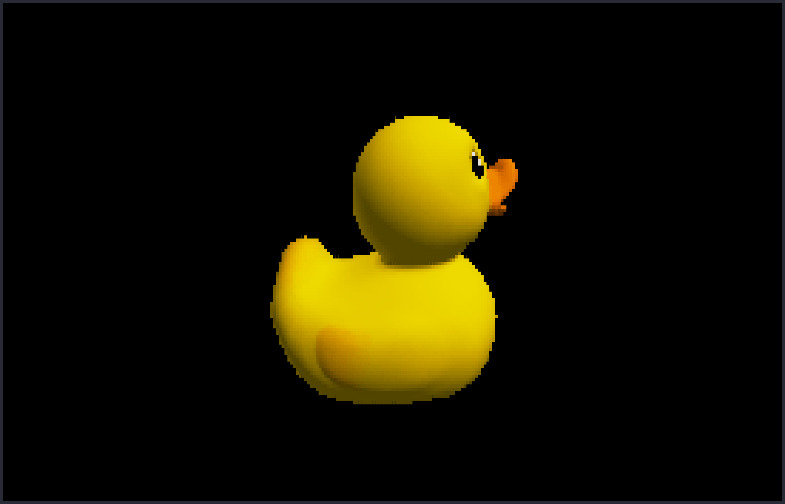
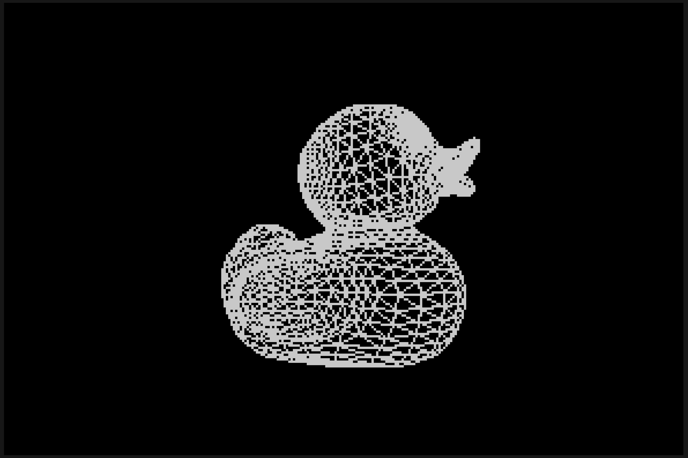
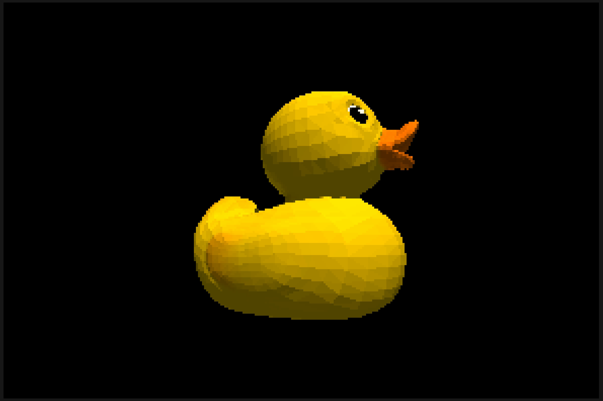
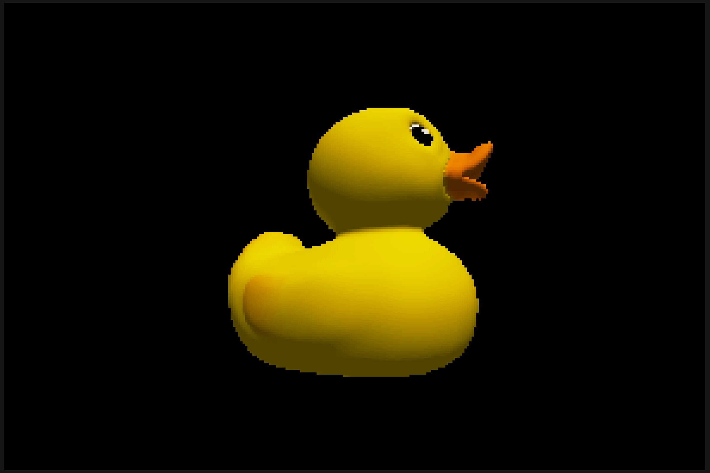

# rasterminal

[](https://github.com/PavolUlicny/rasterminal/actions/workflows/ci.yml)
[](https://github.com/PavolUlicny/rasterminal/releases)
[](LICENSE)
[](https://en.cppreference.com/w/cpp/17)


[](https://github.com/PavolUlicny/rasterminal/commits/main)

**A fast 3D model viewer in the terminal.**



rasterminal renders 3D models on the CPU and draws them in your terminal in real time. It opens OBJ, PLY, STL and glTF files anywhere you have a terminal, over ssh included, with no display and no GPU.

## Contents

- [Quick start](#quick-start)
- [Gallery](#gallery)
- [How it works](#how-it-works)
- [Prebuilt binaries](#prebuilt-binaries)
- [Build](#build)
- [Usage](#usage)
- [Controls](#controls)
- [Supported formats](#supported-formats)
- [Requirements](#requirements)
- [Project status](#project-status)
- [Contributing](#contributing)
- [Third-party libraries](#third-party-libraries)
- [License](#license)

## Quick start

```sh
# 1. Clone and build (release build)
git clone https://github.com/PavolUlicny/rasterminal.git
cd rasterminal
cmake -B build
cmake --build build -j

# 2. Grab a model to look at
curl -fsSL -o Duck.glb \
  https://raw.githubusercontent.com/KhronosGroup/glTF-Sample-Assets/main/Models/Duck/glTF-Binary/Duck.glb

# 3. Render it
./build/rasterminal Duck.glb
```

Drag with the mouse to orbit, scroll to zoom, press `Space` to spin, `1` to `3` to switch shading modes, `Q` to quit.

For a denser model, try the Stanford bunny:

```sh
curl -fsSL -o bunny.stl \
  https://raw.githubusercontent.com/reprap-io/reprapio_stanford_bunny/master/bunny.stl
./build/rasterminal bunny.stl
```

More test assets live in the [Khronos glTF Sample Assets](https://github.com/KhronosGroup/glTF-Sample-Assets) repository; any `.glb`, `.gltf`, `.obj`, `.ply`, or `.stl` file works.

## Gallery

| Wireframe | Flat | Phong |
| --- | --- | --- |
|  |  |  |

## How it works

rasterminal runs the same rasterization pipeline a GPU does, in CPU code. Each frame every triangle goes from model space through the view and projection matrices into clip space, where a world-space backface test drops roughly half of them before any projection work (double-sided materials opt out and flip their normals instead). Triangles crossing the near plane are clipped so nothing renders behind the camera. The rest are scan-converted into fragments, with color, texture coordinates, world position and normals interpolated perspective-correctly, and a z-buffer keeps the nearest fragment at each pixel. Flat shading evaluates Blinn-Phong lighting once per face and Phong evaluates it per pixel; both are modulated by texture sampling and baked ambient occlusion.

Transparent surfaces (glTF `BLEND` materials, MTL `d`/`Tr`, or per-vertex alpha) take a separate path. Their fragments are gathered into a per-pixel list, sorted back to front, and composited over the finished opaque image, so the result is correct even where transparent geometry interpenetrates or is double-sided. Fully opaque models skip that path.

All of it is multi-threaded with a work-stealing scheduler. The opaque pass picks one of two strategies each frame from how large the triangles are on screen: bin them into screen tiles and resolve visibility per tile, so every pixel is shaded once, or rasterize each triangle straight into the framebuffer through a per-pixel atomic that packs depth and color into one slot. On the pixel backends the same threads then compress and encode the finished frame for the terminal.

How the frame reaches the screen depends on what the terminal can do, which a capability query settles at startup. `--graphics` overrides the choice.

- The kitty graphics protocol (kitty, Ghostty, WezTerm) carries real pixels at the window's resolution, scaled by `--graphics-scale` (default 0.75, `1` being native). Locally they travel through shared memory, so almost nothing crosses the terminal pipe per frame; over ssh they go inline, zlib-compressed.
- Sixel (xterm with sixel enabled, foot, mlterm, Windows Terminal 1.22+) draws real pixels at native resolution, quantized to the fixed 240-color xterm palette. The image is capped to the largest size the terminal advertises, since xterm discards anything bigger rather than clipping it, and it never paints the last terminal row, because an image touching it scrolls the screen every frame.
- Half-blocks cover everything else. Each cell holds two vertically stacked pixels drawn as `▀`, foreground for the top and background for the bottom, in 24-bit color, or quantized to the xterm-256 palette where truecolor is missing.

Neither pixel backend works under tmux or GNU screen, which do not pass the protocols through. One xterm limit is not detectable and so not worked around: its `maxStringParse` resource (default 600000) silently drops any frame whose sixel encoding is larger, which very busy scenes can exceed. Raise it with `xterm -xrm '*maxStringParse: 10000000'`.

Whichever backend runs, the whole frame is built in one buffer, written in one call, and wrapped in synchronized-output escapes so capable terminals paint it atomically.

## Prebuilt binaries

Each [release](https://github.com/PavolUlicny/rasterminal/releases) carries binaries for Linux, macOS and Windows. They use portable codegen (no `-march=native`, so they run on any CPU of the target architecture) and are self-contained: the Linux build statically links libstdc++/libgcc and the Windows build statically links the C runtime, so neither needs a runtime package installed.

Download the archive for your platform, then:

```sh
# Linux / macOS
tar xzf rasterminal-<version>-<platform>.tar.gz
cd rasterminal-<version>-<platform>
chmod +x rasterminal
./rasterminal <model>
```

On Windows, extract the `.zip` and run `rasterminal.exe` from a terminal that supports ANSI escapes and UTF-8 (Windows Terminal is recommended; legacy `cmd.exe` is not supported).

Each release includes a `checksums.txt`; verify your download with `sha256sum -c checksums.txt` (Linux), `shasum -a 256 -c checksums.txt` (macOS), or `Get-FileHash` (Windows). `checksums.txt` lists all platforms, so check the line for the archive you downloaded; `-c` reports the other archives as missing, which is expected. To build from source instead, see [Build](#build).

## Build

CMake, on Linux, macOS and Windows, with GCC, Clang, AppleClang or MSVC. There is a release variant (`-march=native`, fastest on the build machine) and a portable one (no `-march=native`, runs on any CPU of the target architecture); every other speed flag (`-O3 -ffast-math -funroll-loops`, LTO and so on) applies to both. `dist` is the binary to ship: portable codegen plus statically linked libstdc++/libgcc, so it runs on older distros without a matching `GLIBCXX` symbol. glibc stays dynamic, so build it on the oldest distro you need to support.

The configurations below are also available as presets (CMake ≥ 3.21):

```sh
cmake --preset release      # or: portable | dist | debug | reldbg | clang
cmake --build --preset release
ctest --preset release      # every preset has a matching build and test preset
```

`RASTERMINAL_PORTABLE` omits `-march=native` / `/arch:AVX2`, `RASTERMINAL_STATIC_LIBSTDCXX` adds the static libstdc++/libgcc link on Linux, and `RASTERMINAL_BUILD_TESTS=OFF` drops the test target entirely. All three default so that a plain `cmake -B build` gives a machine-tuned viewer; the test binary is never part of the default build, so building it costs nothing until you ask for it by name or through `check`.

Equivalent explicit invocations:

```sh
# Release
cmake -B build -DCMAKE_BUILD_TYPE=Release
cmake --build build -j

# Debug
cmake -B build-debug -DCMAKE_BUILD_TYPE=Debug
cmake --build build-debug -j

# Portable (runs on any x86-64, not just the build machine)
cmake -B build-portable -DCMAKE_BUILD_TYPE=Release -DRASTERMINAL_PORTABLE=ON
cmake --build build-portable -j

# Dist (portable + static libstdc++/libgcc, the release artifact)
cmake -B build-dist -DCMAKE_BUILD_TYPE=Release -DRASTERMINAL_PORTABLE=ON -DRASTERMINAL_STATIC_LIBSTDCXX=ON
cmake --build build-dist -j

# Tests (the test binary is not part of the default build)
cmake --build build --target check -j       # build and run the suite in one command
cmake --build build --target rasterminal_tests -j && ctest --test-dir build --output-on-failure

# Clang
cmake -B build-clang -DCMAKE_C_COMPILER=clang -DCMAKE_CXX_COMPILER=clang++ -DCMAKE_BUILD_TYPE=Release
cmake --build build-clang -j

# MSVC (Developer PowerShell or cmd with vcvars)
cmake -B build-msvc
cmake --build build-msvc --config Release -j
ctest --test-dir build-msvc -C Release --output-on-failure
```

### Install

Installs the binary, the man page, and the license/notices following the GNU directory layout (defaulting to `/usr/local`). Build first, then install:

```sh
cmake --build build -j                        # build whichever variant you configured
sudo cmake --install build                    # binary -> /usr/local/bin, man page -> .../share/man/man1, docs -> .../share/doc/rasterminal
sudo cmake --build build --target uninstall   # remove everything install added
```

Override the prefix to install without root, or stage into a fakeroot for packaging:

```sh
cmake --install build --prefix ~/.local   # no sudo; ensure ~/.local/bin is on PATH
DESTDIR=/tmp/pkg cmake --install build    # staged install for packagers
```

CMake's `uninstall` reads the `install_manifest.txt` its install step wrote, so it removes
exactly what that build directory installed. Pass the same `DESTDIR` you installed with.

## Usage

```sh
rasterminal [options] <model>
```

| Flag | Short | Default | Description |
| --- | --- | --- | --- |
| `--shading` | `-s` | `phong` | `wireframe`, `flat`, `phong` |
| `--bg` | `-b` | `black` | `black`, `gray`, `white` |
| `--lighting` | `-l` | `dual` | `dual`, `single`, `flat` |
| `--wireframe-color` | `-w` | `white` | `white`, `red`, `green`, `yellow`, `cyan`, `magenta` |
| `--yaw` | none | `0` | Initial camera yaw in degrees `[-180, 180]`; positive turns the model left on screen |
| `--pitch` | none | `-17.2` | Initial camera pitch in degrees `[-180, 180]`; negative looks down from above. Under `--first-person` it is clamped to just inside straight up and straight down, the limit that mode holds while you look |
| `--zoom` | none | `1` | Initial zoom `[0.2, 100]` as a size multiplier of the auto-fit framing, `2` being twice as close. The bounds are the scroll wheel's range in orbit mode; under `--first-person` this sets how far back you start and the wheel sets movement speed |
| `--cull` / `--no-cull` | none | `on` | Backface culling initial state |
| `--texture` / `--no-texture` | none | `on` | Texture rendering initial state |
| `--spin` / `--no-spin` | `-S` | `off` | Auto-rotation initial state |
| `--threads [N]` | `-j [N]` | per backend | Worker threads: all cores under kitty and sixel, `min(cores, 4)` under half-blocks. Loading a model always uses all cores. Bare `-j` uses all cores, and `N` above the CPU thread count is clamped |
| `--fps [N]` | `-f [N]` | `30` | Frame cap; bare `-f` uncaps |
| `--smooth-angle` | none | `60` | Crease angle in degrees `[0, 180]` for computed normals; `0` = faceted, `180` = fully smooth (ignored when an OBJ authors smoothing groups) |
| `--color` | none | `auto` | `truecolor`/`24bit`, `256`, `auto`; with the kitty graphics backend the image is always 24-bit and with sixel always 240-color, so there this affects only the HUD line |
| `--graphics` | none | `auto` | `kitty`, `sixel`, `blocks`, `auto`. `auto` draws real pixels through the kitty graphics protocol where the terminal supports it, then sixel where advertised, else half-blocks |
| `--graphics-scale` | none | `0.75` | Render scale for the kitty backend in `[0.05, 1]`, `1` being native. The frame renders at this fraction of the window's pixel resolution and the terminal stretches it back over the same cells, trading sharpness for speed. Neither other backend scales, so an explicit `--graphics blocks` or `--graphics sixel` makes it an error; it is inert when `auto` falls back to either |
| `--spin-speed` | none | `45` | Auto-rotation speed in degrees per second (positive number); applies whenever spinning is active |
| `--spin-direction` | none | `left` | `left`, `right`, the way the model's front face moves on screen. Under `--first-person` nothing is being orbited, so it names the way the view itself turns |
| `--bench [N]` | `-B [N]` | `200` | Headless benchmark over N frames; prints a startup/runtime report to stderr and exits |
| `--bench-size` | none | `200x120` | Bench framebuffer size in pixels (`WxH`); requires `--bench` |
| `--bench-warmup` | none | `20` | Warmup frames discarded before measurement; requires `--bench` |
| `--ao` / `--no-ao` | none | `on` | Baked ambient occlusion |
| `--hud` / `--no-hud` | none | `shown` | HUD status line |
| `--input` / `--no-input` | none | `on` | Keyboard and mouse controls; `--no-input` ignores every binding except `Q` (and Ctrl+C) |
| `--first-person` / `--no-first-person` | none | `off` | Free-flying first-person camera instead of the turntable (no gravity, collision or ground plane) |
| `--first-person-speed` | none | `1` | Initial movement speed `[0.05, 20]` as a multiplier of the model-scaled default; the bounds equal the range `+`/`-` and the wheel move within; requires `--first-person` |
| `--help` | `-h` | none | Print usage and exit |
| `--version` | `-V` | none | Print version and exit |

String values are case-insensitive. Long flags that take a value accept `--flag value` or `--flag=value`; short flags accept `-f value` or `-fvalue`. Boolean flags take no value: `--cull=on` is an error, not a synonym for `--cull`. The paired flags above (for example `--cull` and `--no-cull`) select the two states directly, and where both appear the later one on the command line wins.

## Controls

| Key | Action |
| --- | --- |
| `W` `A` `S` `D` / arrow keys | Orbit camera |
| `+` / `-` | Zoom in / out |
| Mouse drag | Orbit camera |
| Scroll wheel | Zoom |
| `1` `2` `3` | Wireframe / flat / Phong shading |
| `L` | Cycle lighting (dual → single → flat) |
| `B` | Cycle background (black → gray → white) |
| `C` | Cycle wireframe color |
| `T` | Toggle texture rendering |
| `K` | Toggle backface culling |
| `Space` | Toggle auto-rotation |
| `R` | Reset to the state set by the command-line flags (their defaults when not passed) |
| `Q` / `Ctrl+C` | Quit |

`--no-input` ignores every binding in this table except the last: `Q` and Ctrl+C still quit. The mouse stays claimed by the viewer, so a drag neither orbits nor selects text.

### First-person controls

`--first-person` swaps the turntable for a free-flying camera. There is no gravity, collision or ground plane: it flies, and passes through geometry. Only the camera bindings change. The shading, lighting, background, wireframe-color, texture and culling keys behave as they do above, as do `R` and `Q`, and `Space` still starts and stops auto-rotation.

| Key | Action |
| --- | --- |
| `W` `A` `S` `D` | Move forward / left / back / right, following where you are looking |
| `E` / `V` | Move up / down along world up, whatever the view is pitched to |
| Arrow keys | Look |
| Mouse drag | Look |
| `+` / `-`, scroll wheel | Movement speed |

The camera cannot be flown off into empty space: its outer limit is the distance the scroll wheel reaches in orbit mode. It can still be pointed away from the model, and `R` returns to the launch view and speed. At `--zoom 0.2` you start at that outer limit, so flying backwards does nothing until you move in. Pitch stops at straight up and straight down, so the horizon never inverts. The near plane is scaled to the model rather than to the mode, so a surface can pass inside it and vanish just before you reach it.

Movement speed scales with the model, so the keys feel the same on a tiny model and a huge one, and `--first-person-speed` sets where it starts. `Space` still spins, which here is a slow panorama from wherever the camera stands, worth trying from inside a large scene.

Only one key moves you at a time, so there is no diagonal flight: you cannot hold forward and strafe together, or move and turn together from the keyboard. That is terminal input rather than a choice, since a terminal sends no key releases and the operating system repeats only the most recently pressed key. Drag the mouse to look while you move.

## Supported formats

| Format | Notes |
| --- | --- |
| OBJ / MTL | Triangles, quads, n-gons; diffuse (`map_Kd`), specular (`map_Ks`), and normal (`map_Bump` / `norm`) maps |
| PLY | ASCII and binary (LE/BE); vertex and face colors |
| STL | ASCII and binary; the format's conventional Z-up orientation is remapped so models load upright. ASCII files are rejected if any single line exceeds 64 KB (a malformed-input guard; the format puts one short statement per line) |
| glTF 2.0 | External and embedded (GLB); PBR materials, vertex colors, double-sided, second UV set (`TEXCOORD_1`); `KHR_draco_mesh_compression`, `EXT_meshopt_compression`/`KHR_meshopt_compression`, `KHR_texture_basisu` (KTX2), `EXT_texture_webp`, `KHR_materials_unlit`, `KHR_texture_transform` |

## Requirements

Any terminal with UTF-8 support, ANSI color, and mouse reporting for drag-to-orbit and scroll-to-zoom.

Color is 24-bit where the terminal supports it and 256 colors elsewhere, decided from `COLORTERM`, `TERM`, `TMUX` and `STY`, with `--color` overriding. A `dumb` terminal, or a Windows console that cannot enable ANSI escape processing, is rejected outright. Inside GNU screen the 256-color fallback always applies, since screen 4.x garbles 24-bit color and the inherited `COLORTERM` describes the outer terminal. Under a pixel backend the setting reaches only the HUD line: kitty frames are always 24-bit and sixel frames always the 240-color palette.

Pixel rendering is optional and detected by a startup query, kitty preferred over sixel, with `--graphics` overriding. kitty renders at 0.75 of the window resolution by default (`--graphics-scale 1` for native); sixel renders at native resolution, and stock xterm needs sixel switched on, for example `xterm -ti vt340`. Neither is available under tmux or GNU screen, where kitty is not passed through and sixel support is build-dependent and not detected.

Both standard input and standard output must be the terminal. If either is piped or redirected, rasterminal exits with an error rather than emitting escape sequences into the stream; the headless `--bench` mode is exempt.

Known to work well with iTerm2, kitty, WezTerm, Windows Terminal, and most modern Linux terminals.

## Project status

Pre-1.0 and under active development. It works today, but expect rough edges, and CLI flags or controls may change before 1.0.

## Contributing

Bug reports and feature requests are welcome through the [issue forms](https://github.com/PavolUlicny/rasterminal/issues/new/choose). Code contributions are welcome too: see [CONTRIBUTING.md](CONTRIBUTING.md) for how to build, test, and format your changes, and for anything larger than a small fix, please open an issue first to discuss it.

## Third-party libraries

Vendored under `vendor/`; see `THIRD_PARTY_NOTICES` for full license texts.

| Library | Version | License | Use |
| --- | --- | --- | --- |
| [cgltf](https://github.com/jkuhlmann/cgltf) | master (post-v1.15) | MIT | glTF / GLB parsing |
| [stb_image](https://github.com/nothings/stb) | v2.30 | MIT / Unlicense | Image loading |
| [stl_reader](https://github.com/sreiter/stl_reader) | v2.0 | BSD-2 | STL parsing |
| [tinyobjloader](https://github.com/tinyobjloader/tinyobjloader) | v2.0.0rc13 | MIT | OBJ / MTL parsing |
| [tinyply](https://github.com/ddiakopoulos/tinyply) | 3.0 | Public domain | PLY parsing |
| [meshoptimizer](https://github.com/zeux/meshoptimizer) | v1.1 | MIT | Vertex cache / overdraw / fetch optimization |
| [draco](https://github.com/google/draco) | 1.5.7 | Apache-2.0 | Draco mesh decompression (`KHR_draco_mesh_compression`) |
| [basis_universal](https://github.com/BinomialLLC/basis_universal) | v2_1_0r | Apache-2.0 | KTX2 / Basis Universal texture transcoding (`KHR_texture_basisu`) |
| [zstd](https://github.com/facebook/zstd) | bundled w/ basis_universal v2_1_0r | BSD-3 | Zstd decompression for KTX2 UASTC payloads |
| [libwebp](https://chromium.googlesource.com/webm/libwebp) | v1.6.0 | BSD-3 + PATENTS | WebP texture decoding (`EXT_texture_webp`) |
| [miniz](https://github.com/richgel999/miniz) | 3.1.2 | MIT | zlib deflate for the kitty graphics direct transport |

## License

rasterminal is released under the MIT License; see [`LICENSE`](LICENSE). Vendored third-party libraries retain their own licenses, reproduced in full in [`THIRD_PARTY_NOTICES`](THIRD_PARTY_NOTICES).
